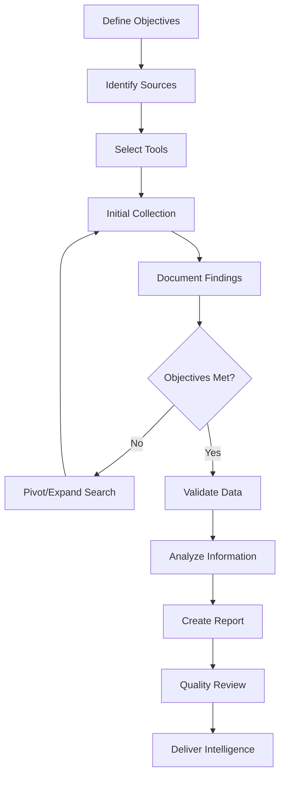

# OSINT Collection Plan Framework

## Table of Contents
1. [Introduction](#introduction)
2. [Planning Phase](#planning-phase)
3. [Collection Phase](#collection-phase)
4. [Processing and Analysis Phase](#processing-and-analysis-phase)
5. [Dissemination Phase](#dissemination-phase)
6. [Legal and Ethical Considerations](#legal-and-ethical-considerations)
7. [Templates and Workflows](#templates-and-workflows)

---

## Introduction

This OSINT Collection Plan provides a structured framework for conducting open-source intelligence gathering operations using the tools and resources available in this repository. This plan follows the intelligence cycle: Planning, Collection, Processing, Analysis, and Dissemination.

### What is a Collection Plan?

An OSINT collection plan is a systematic approach to gathering publicly available information to meet specific intelligence requirements. It ensures that collection efforts are:
- **Focused**: Aligned with clear objectives
- **Efficient**: Using appropriate tools and methods
- **Legal**: Compliant with laws and regulations
- **Organized**: Structured and documented
- **Effective**: Producing actionable intelligence

---

## Planning Phase

### Step 1: Define Collection Objectives

#### 1.1 Identify Intelligence Requirements
Before beginning any OSINT operation, clearly define what you need to know:

**Questions to Answer:**
- What specific information are you looking for?
- Why is this information needed?
- Who is the target audience for this intelligence?
- What decisions will be based on this intelligence?

**Example Intelligence Requirements:**
- Identify online presence of a person
- Investigate a company's digital footprint
- Assess threat actor capabilities
- Monitor brand reputation
- Verify information authenticity

#### 1.2 Determine Priority Intelligence Requirements (PIRs)

Rank your intelligence requirements by priority:
- **Critical**: Must-have information for decision-making
- **High**: Important but not immediately critical
- **Medium**: Useful supporting information
- **Low**: Nice-to-have background information

#### 1.3 Define Success Criteria

Establish what constitutes successful collection:
- Specific data points or metrics
- Quality and reliability standards
- Timeliness requirements
- Completeness expectations

### Step 2: Identify Information Sources

#### 2.1 Map Potential Data Sources

Based on your intelligence requirements, identify relevant sources from this repository:

**For People/Identity Investigations:**
- [Username](#username) - Cross-platform username searches
- [Email](#email) - Email verification and OSINT
- [Phone](#phone) - Phone number lookups
- [Social Media](#social-media) - Multiple platform investigations
- [People](#people) - People search engines

**For Domain/Infrastructure Investigations:**
- [Domain / IP / DNS](#domain--ip--dns) - Network reconnaissance
- [Whois](#whois) - Domain registration information
- [Source Codes](#source-codes) - Code repository searches
- [Malware](#malware) - Threat analysis tools

**For Geospatial Investigations:**
- [Geo](#geo) - Geographic intelligence tools
- [Maps](#maps) - Mapping and location services
- [Satellite Imagery](#maps) - Aerial and satellite views

**For Business/Corporate Investigations:**
- [Business](#business) - Company information databases
- [Public Records](#public-records) - Legal and court records
- [Finance](#finance) - Financial intelligence tools

**For Threat Intelligence:**
- [Threat Intel](#threat-intel) - Threat intelligence platforms
- [Breaches and Leaks](#breaches-and-leaks) - Data breach databases
- [Darknet](#darknet) - Dark web monitoring

#### 2.2 Source Prioritization Matrix

| Source Type | Relevance | Accessibility | Reliability | Priority |
|-------------|-----------|---------------|-------------|----------|
| Social Media | High | High | Medium | 1 |
| Public Records | High | Medium | High | 1 |
| WHOIS Data | Medium | High | High | 2 |
| Dark Web | Low | Low | Low | 3 |

### Step 3: Select Collection Methods and Tools

#### 3.1 Manual Collection Methods

**Open Source Research:**
- Search engines (Google, Bing, Yandex)
- Social media platforms
- Public databases
- News archives
- Government records

**Recommended Tools from Repository:**
- [Google CSE](#google-cse) - Custom search engines
- [Search Engines](#search-engines) - Specialized search tools
- [Archive Tools](#productivity) - Wayback Machine, Archive.is

#### 3.2 Automated Collection Methods

**Web Scraping and Automation:**
- API-based collection
- Automated searches
- Bulk data processing
- Scheduled monitoring

**Recommended Tools from Repository:**
- [Toolset](#toolset) - Automation and analysis tools
- [Recon](#recon) - Reconnaissance frameworks
- [Bot](#bot) - Automated collection bots

#### 3.3 Specialized Collection Techniques

**Technical OSINT (TECHINT):**
- Network reconnaissance
- Subdomain enumeration
- Port scanning
- SSL certificate analysis
- Technology stack identification

**Geospatial OSINT (GEOINT):**
- Satellite imagery analysis
- Location verification
- Geolocation techniques
- Movement tracking

**Social Media Intelligence (SOCMINT):**
- Profile analysis
- Network mapping
- Timeline reconstruction
- Sentiment analysis

**Human Intelligence Support (HUMINT):**
- Contact information gathering
- Relationship mapping
- Organization charts
- Professional networks

### Step 4: Develop Collection Timeline

#### 4.1 Create Collection Schedule

**Phase 1: Initial Reconnaissance (Days 1-2)**
- Define scope and objectives
- Identify key sources
- Set up collection tools
- Establish baseline information

**Phase 2: Deep Dive Collection (Days 3-7)**
- Execute primary collection methods
- Document findings continuously
- Pivot based on discoveries
- Expand search parameters as needed

**Phase 3: Gap Analysis (Days 8-9)**
- Review collected information
- Identify information gaps
- Conduct targeted follow-up collection
- Verify critical findings

**Phase 4: Final Validation (Day 10)**
- Cross-reference sources
- Verify data accuracy
- Complete documentation
- Prepare for analysis

#### 4.2 Set Milestones and Checkpoints

- Daily progress reviews
- Weekly objective assessments
- Bi-weekly stakeholder updates
- Final deliverable deadline

---

## Collection Phase

### Step 5: Execute Collection Operations

#### 5.1 Search Engine Intelligence (SEINT)

**Google Dorks:**
```
site:example.com filetype:pdf
site:linkedin.com "company name" "position"
inurl:admin site:example.com
intitle:"index of" site:example.com
```

**Tools:** [Dorkgpt](#toolset), [Google Custom Search](#google-cse)

#### 5.2 Social Media Collection

**Platforms to Monitor:**
- Facebook - [Facebook Tools](#facebook)
- Twitter/X - [Twitter Tools](#twitter)
- LinkedIn - [LinkedIn Tools](#linkedin)
- Instagram - [Instagram Tools](#instagram)
- Reddit - [Reddit Tools](#reddit)
- TikTok - [TikTok Tools](#tiktok)
- Discord - [Discord Tools](#discord)

**Collection Focus:**
- Profile information
- Posts and content
- Connections and networks
- Location data
- Temporal patterns
- Engagement metrics

#### 5.3 Domain and Network Intelligence

**Collection Tasks:**
1. WHOIS lookup - [Whois Tools](#whois)
2. DNS enumeration - [DNS Tools](#domain--ip--dns)
3. Subdomain discovery - [Domain Tools](#domain--ip--dns)
4. SSL certificate analysis - [Certificate Search](#domain--ip--dns)
5. Technology identification - [Wappalyzer](#domain--ip--dns)
6. Port scanning - [Shodan](#domain--ip--dns)
7. Historical data - [Archive Tools](#productivity)

#### 5.4 Data Breach Intelligence

**Sources:**
- [Dehashed](#breaches-and-leaks)
- [Have I Been Pwned](#breaches-and-leaks)
- [Intelligence X](#breaches-and-leaks)
- [LeakCheck](#breaches-and-leaks)

**Collection Process:**
1. Search for email addresses
2. Check for username exposures
3. Identify breach sources
4. Document password patterns
5. Note associated data

#### 5.5 Geospatial Intelligence

**Collection Methods:**
- Satellite imagery analysis - [Maps Tools](#maps)
- Street view reconnaissance - [Mapillary](#maps)
- Location verification - [GeoSpy](#geo)
- Webcam monitoring - [IoT/Webcams](#iot)
- Flight/vessel tracking - Various tracking tools

#### 5.6 Document and File Intelligence

**Analysis Focus:**
- Metadata extraction - [FOCA](#recon)
- Document properties - [Metadata Tools](#privacy--security)
- Author information
- Creation timestamps
- Software versions
- Hidden content

### Step 6: Document Collection Process

#### 6.1 Evidence Preservation

**Documentation Requirements:**
- Source URL and access timestamp
- Screenshot or archive of original content
- Chain of custody notes
- Collection method used
- Tool versions and settings

**Tools for Preservation:**
- [Archive.is](#productivity) - Web page archiving
- [Wayback Machine](#productivity) - Historical snapshots
- Screenshot tools - [Browser Tools](#toolset)
- Metadata preservation - [Metadata Tools](#privacy--security)

#### 6.2 Note-Taking Best Practices

**Structured Notes Should Include:**
- Date and time of collection
- Source identification
- Relevance to objectives
- Reliability assessment
- Follow-up actions needed
- Links to related information

**Recommended Format:**
```markdown
## Collection Entry

**Date:** 2025-12-30
**Time:** 14:30 UTC
**Collector:** [Your ID]
**Source:** Twitter @username
**URL:** [archived link]
**Relevance:** High - confirms target location
**Reliability:** Medium - social media post
**Notes:** User posted photo geotagged at [location]
**Follow-up:** Verify with additional sources
```

---

## Processing and Analysis Phase

### Step 7: Process Collected Information

#### 7.1 Data Organization

**Categorization Methods:**
- By source type
- By intelligence requirement
- By reliability level
- By temporal order
- By subject/entity

**Storage Structure:**
```
Project_Name/
├── 01_Planning/
│   ├── objectives.md
│   ├── sources.md
│   └── timeline.md
├── 02_Collection/
│   ├── social_media/
│   ├── public_records/
│   ├── technical/
│   └── geospatial/
├── 03_Analysis/
│   ├── timelines/
│   ├── network_maps/
│   └── findings/
├── 04_Evidence/
│   ├── screenshots/
│   ├── archives/
│   └── documents/
└── 05_Reports/
    ├── interim/
    └── final/
```

#### 7.2 Data Validation

**Validation Techniques:**
- Cross-reference multiple sources
- Verify with authoritative databases
- Check for temporal consistency
- Assess source credibility
- Look for contradictions
- Validate technical details

**Source Reliability Scale:**
- A: Completely reliable
- B: Usually reliable
- C: Fairly reliable
- D: Not usually reliable
- E: Unreliable
- F: Cannot be judged

**Information Credibility Scale:**
- 1: Confirmed by other sources
- 2: Probably true
- 3: Possibly true
- 4: Doubtful
- 5: Improbable
- 6: Cannot be judged

### Step 8: Analyze Collected Data

#### 8.1 Link Analysis

**Relationship Mapping:**
- Identify connections between entities
- Map communication patterns
- Discover hidden relationships
- Track organizational structures

**Tools:** [Lampyre](#basic-osint), [Maltego-like tools](#toolset)

#### 8.2 Timeline Analysis

**Temporal Reconstruction:**
- Create chronological events
- Identify patterns over time
- Note significant dates
- Track activity patterns

**Key Elements:**
- Event date/time
- Event description
- Source of information
- Significance level

#### 8.3 Pattern Recognition

**Look For:**
- Recurring behaviors
- Communication patterns
- Location patterns
- Association patterns
- Temporal patterns

#### 8.4 Gap Analysis

**Identify Missing Information:**
- Critical data not collected
- Conflicting information requiring resolution
- Areas needing additional verification
- Unexplored sources

---

## Dissemination Phase

### Step 9: Create Intelligence Products

#### 9.1 Report Types

**Situation Report (SITREP):**
- Current state of affairs
- Recent developments
- Immediate concerns

**Intelligence Summary:**
- Key findings
- Supporting evidence
- Confidence levels
- Recommendations

**Comprehensive Report:**
- Executive summary
- Detailed findings
- Methodology
- Sources and evidence
- Analysis and conclusions
- Recommendations
- Appendices

#### 9.2 Visualization

**Present Data Visually:**
- Network graphs
- Timelines
- Geographic maps
- Charts and statistics
- Screenshots and photos

**Visualization Tools:**
- [Vega Editor](#toolset)
- [MindMup](#productivity)
- [Graphviz](#toolset)
- Various mapping tools

#### 9.3 Report Structure Template

```markdown
# Intelligence Report: [Title]

**Classification:** [UNCLASSIFIED/CONFIDENTIAL]
**Date:** [Date]
**Prepared by:** [Name/Team]
**Distribution:** [Recipients]

## Executive Summary
[Brief overview of key findings and recommendations]

## Intelligence Requirements
[Original objectives and questions]

## Key Findings
1. [Finding 1]
   - Evidence: [Source links]
   - Confidence: [High/Medium/Low]
   
2. [Finding 2]
   - Evidence: [Source links]
   - Confidence: [High/Medium/Low]

## Detailed Analysis
[Comprehensive analysis of collected information]

## Methodology
[Collection methods and tools used]

## Source Assessment
[Evaluation of source reliability]

## Conclusions
[Final assessments and judgments]

## Recommendations
[Actionable recommendations]

## Appendices
- Appendix A: Timeline
- Appendix B: Network Map
- Appendix C: Raw Data
- Appendix D: Screenshots
```

### Step 10: Quality Control

#### 10.1 Review Checklist

- [ ] All PIRs addressed
- [ ] Sources properly cited
- [ ] Evidence preserved
- [ ] Analysis is logical and supported
- [ ] Alternative hypotheses considered
- [ ] Confidence levels assigned
- [ ] Recommendations are actionable
- [ ] Legal and ethical standards met
- [ ] Proper classification applied
- [ ] Reviewed by second analyst

#### 10.2 Peer Review

**Have Another Analyst Review:**
- Methodology soundness
- Analytical conclusions
- Evidence interpretation
- Missing information
- Alternative explanations

---

## Legal and Ethical Considerations

### Legal Compliance

#### Applicable Laws and Regulations

**United States:**
- Computer Fraud and Abuse Act (CFAA)
- Electronic Communications Privacy Act (ECPA)
- Stored Communications Act (SCA)
- State privacy laws

**European Union:**
- General Data Protection Regulation (GDPR)
- ePrivacy Directive

**United Kingdom:**
- Data Protection Act 2018
- Computer Misuse Act 1990
- Investigatory Powers Act 2016

#### Do's and Don'ts

**DO:**
- Only collect publicly available information
- Respect terms of service
- Document your sources
- Maintain chain of custody
- Respect privacy where applicable
- Use passive collection methods
- Stay within legal boundaries

**DON'T:**
- Hack or unauthorized access
- Impersonate others
- Use stolen credentials
- Violate terms of service
- Harass or threaten subjects
- Collect illegal content
- Share personal info publicly

### Ethical Guidelines

#### Ethical Principles

1. **Respect Privacy**: Minimize privacy intrusion
2. **Transparency**: Be honest about your methods
3. **Proportionality**: Match methods to legitimate needs
4. **Responsibility**: Consider impact of your actions
5. **Accuracy**: Strive for truth and correctness
6. **Legality**: Always operate within the law

#### Professional Standards

- Maintain objectivity
- Avoid bias and prejudice
- Protect sensitive information
- Report illegal activity
- Continuous learning and improvement
- Seek proper authorization

### Operational Security (OPSEC)

#### Protect Your Identity

**Recommended Practices:**
- Use VPN - [VPN Services](#secure-communication)
- Use Tor Browser - [Tor Project](#secure-communication)
- Create separate accounts
- Use virtual machines
- Clear browser data regularly
- Disable JavaScript when needed
- Use privacy-focused browsers

**Tools from Repository:**
- [Brave Browser](#secure-communication)
- [ProtonVPN](#secure-communication)
- [Tor Browser](#secure-communication)

#### Avoid Detection

**Best Practices:**
- Don't login with personal accounts
- Avoid rapid/automated queries
- Randomize timing of requests
- Use different IP addresses
- Clear cookies and cache
- Disable location services
- Be aware of digital footprint

---

## Templates and Workflows

### Template 1: Quick Investigation Workflow

**Target:** [Person/Company/Domain]

**Intelligence Requirements:**
1. ___________
2. ___________
3. ___________

**Phase 1: Initial Assessment (30 minutes)**
- [ ] Google search: [Name/Domain]
- [ ] Social media check: Facebook, LinkedIn, Twitter
- [ ] Username search: [WhatsMyName](#privacy--security)
- [ ] Email verification: [Breach databases](#breaches-and-leaks)

**Phase 2: Deep Dive (2-4 hours)**
- [ ] WHOIS lookup: [Domain]
- [ ] Subdomain enumeration
- [ ] Historical data: Wayback Machine
- [ ] Public records: [Court records, business registrations]
- [ ] Social media timeline analysis

**Phase 3: Validation (1 hour)**
- [ ] Cross-reference findings
- [ ] Verify critical information
- [ ] Document evidence
- [ ] Create timeline

**Phase 4: Report (1-2 hours)**
- [ ] Write findings
- [ ] Attach evidence
- [ ] Present conclusions

### Template 2: Domain Investigation

**Target Domain:** ___________

**1. Registration Information**
- [ ] WHOIS: [Whois Tools](#whois)
- [ ] Historical WHOIS: [WHOIS History](#whois)
- [ ] Registrar information
- [ ] Name servers

**2. Infrastructure**
- [ ] DNS records: [DNS Tools](#domain--ip--dns)
- [ ] Subdomains: [Subdomain Tools](#domain--ip--dns)
- [ ] IP addresses: [IP Lookup](#domain--ip--dns)
- [ ] Hosting provider
- [ ] SSL certificates: [Certificate Search](#domain--ip--dns)
- [ ] Technology stack: [Wappalyzer](#domain--ip--dns)

**3. Content Analysis**
- [ ] Current content: Browser
- [ ] Historical content: [Wayback Machine](#productivity)
- [ ] Hidden pages: Robots.txt, sitemap.xml
- [ ] Metadata: [Source code analysis](#source-codes)

**4. Security Assessment**
- [ ] Open ports: [Shodan](#domain--ip--dns)
- [ ] Vulnerabilities: [Security Tools](#recon)
- [ ] Malware check: [VirusTotal](#malware)
- [ ] Blacklist status

**5. Associated Entities**
- [ ] Related domains
- [ ] Email addresses
- [ ] Social media accounts
- [ ] Contact information

### Template 3: Person Investigation

**Target:** ___________

**1. Basic Information**
- [ ] Full name variations
- [ ] Date of birth
- [ ] Known addresses
- [ ] Phone numbers
- [ ] Email addresses

**2. Online Presence**
- [ ] Social Media: [All platforms](#social-media)
- [ ] Usernames: [Username search](#username)
- [ ] Professional profiles: [LinkedIn](#linkedin)
- [ ] Personal websites/blogs

**3. Public Records**
- [ ] Court records: [Court search](#public-records)
- [ ] Property records: [Real estate](#real-estate)
- [ ] Business registrations: [Business search](#business)
- [ ] Professional licenses

**4. Digital Footprint**
- [ ] Data breaches: [Breach databases](#breaches-and-leaks)
- [ ] Forum posts: [Forum search]
- [ ] Comments and reviews
- [ ] Published content

**5. Relationships**
- [ ] Family members
- [ ] Associates
- [ ] Professional connections
- [ ] Organization affiliations

### Template 4: Company Investigation

**Target Company:** ___________

**1. Corporate Information**
- [ ] Business registration: [Business databases](#business)
- [ ] Leadership/Officers
- [ ] Address/Locations
- [ ] Contact information
- [ ] Industry/NAICS code

**2. Digital Presence**
- [ ] Website: [Domain analysis]
- [ ] Social media: [Company pages](#social-media)
- [ ] Reviews and ratings
- [ ] News mentions: [News search](#news)

**3. Financial**
- [ ] Public filings: [Finance tools](#finance)
- [ ] Revenue/Employees
- [ ] Funding history
- [ ] Credit rating

**4. Network**
- [ ] Parent company
- [ ] Subsidiaries
- [ ] Partners/Vendors
- [ ] Competitors

**5. Reputation**
- [ ] Legal issues: [Court records](#public-records)
- [ ] Complaints
- [ ] Industry standing
- [ ] Media coverage

### Workflow: Comprehensive OSINT Investigation



### Checklist: Pre-Investigation Setup

**Infrastructure:**
- [ ] Secure workstation/VM
- [ ] VPN connection active
- [ ] Tor Browser installed
- [ ] Anonymous email account
- [ ] Burner phone number (if needed)
- [ ] Cloud storage for evidence
- [ ] Note-taking system ready

**Documentation:**
- [ ] Case file created
- [ ] Collection plan written
- [ ] Evidence log template
- [ ] Reporting template ready

**Tools:**
- [ ] Browser extensions installed
- [ ] OSINT tools tested
- [ ] API keys configured
- [ ] Backup tools ready

**Legal/Ethical:**
- [ ] Scope authorized
- [ ] Legal review completed
- [ ] Privacy considerations noted
- [ ] Terms of service reviewed

---

## Tool Reference by Investigation Type

### Username Investigation
**Primary Tools:**
- [WhatsMyName](#privacy--security)
- [Username Search](#unified-search)
- [Sherlock-like tools](#username)

### Email Investigation
**Primary Tools:**
- [Email verification](#email)
- [Breach databases](#breaches-and-leaks)
- [Email finder tools](#basic-osint)

### Phone Investigation
**Primary Tools:**
- [Phone lookup services](#phone)
- [Reverse phone search](#phone)
- [Carrier identification](#phone)

### Domain Investigation
**Primary Tools:**
- [WHOIS services](#whois)
- [DNS tools](#domain--ip--dns)
- [Subdomain enumeration](#domain--ip--dns)
- [SSL certificate search](#domain--ip--dns)

### Social Media Investigation
**Primary Tools:**
- Platform-specific tools for [Facebook](#facebook), [Twitter](#twitter), [LinkedIn](#linkedin), [Instagram](#instagram)
- [Social media search](#social-media)
- [Profile downloaders](#downloader)

### Geospatial Investigation
**Primary Tools:**
- [GeoSpy](#geo)
- [Mapping services](#maps)
- [Satellite imagery](#maps)
- [Webcams](#iot)

### Business Investigation
**Primary Tools:**
- [Company databases](#business)
- [Corporate records](#business)
- [Financial tools](#finance)
- [Public filings](#public-records)

### Threat Intelligence
**Primary Tools:**
- [Threat intel platforms](#threat-intel)
- [Malware analysis](#malware)
- [IOC databases](#threat-intel)
- [Dark web monitoring](#darknet)

---

## Conclusion

This OSINT Collection Plan provides a comprehensive framework for conducting open-source intelligence operations. Remember that effective OSINT requires:

1. **Clear objectives** - Know what you're looking for
2. **Systematic approach** - Follow a structured process
3. **Proper documentation** - Record everything
4. **Ethical conduct** - Stay legal and moral
5. **Continuous learning** - Tools and techniques evolve

The tools and resources in this repository provide everything needed to conduct professional OSINT investigations. Always prioritize legal compliance and ethical conduct in all collection activities.

---

## Additional Resources

### Training and Learning
- [OSINT Curious Project](#resources)
- [IntelTechniques](#resources)
- [Bellingcat](#resources)
- [OSINT Framework](#resources)

### Community and Updates
- Follow OSINT practitioners on Twitter
- Join OSINT communities and forums
- Attend OSINT conferences
- Subscribe to OSINT newsletters

### Recommended Reading
- OSINT techniques and methodology books
- Legal guides for investigators
- Privacy and security handbooks
- Analytical thinking guides

---

**Last Updated:** December 2025
**Version:** 1.0

For questions, contributions, or suggestions, please refer to the main repository.
