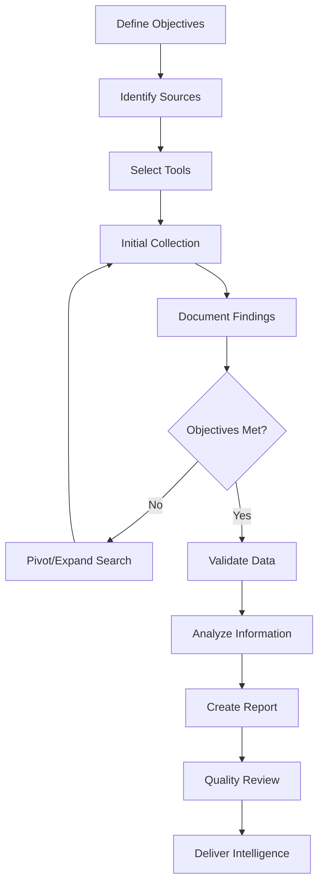

# OSINT Collection Plan Framework

## Table of Contents
# <<<<<<< copilot/build-collection-plan-osint
1. [Introduction](#introduction)
2. [Planning Phase](#planning-phase)
3. [Collection Phase](#collection-phase)
4. [Processing and Analysis Phase](#processing-and-analysis-phase)
5. [Dissemination Phase](#dissemination-phase)
6. [Legal and Ethical Considerations](#legal-and-ethical-considerations)
7. [Templates and Workflows](#templates-and-workflows)

---

## Introduction

This OSINT Collection Plan provides a structured framework for conducting open-source intelligence gathering operations using the tools and resources available in this repository. This plan follows the intelligence cycle: Planning, Collection, Processing, Analysis, and Dissemination.

### What is a Collection Plan?

An OSINT collection plan is a systematic approach to gathering publicly available information to meet specific intelligence requirements. It ensures that collection efforts are:
- **Focused**: Aligned with clear objectives
- **Efficient**: Using appropriate tools and methods
- **Legal**: Compliant with laws and regulations
- **Organized**: Structured and documented
- **Effective**: Producing actionable intelligence

---

## Planning Phase

### Step 1: Define Collection Objectives

#### 1.1 Identify Intelligence Requirements
Before beginning any OSINT operation, clearly define what you need to know:

**Questions to Answer:**
- What specific information are you looking for?
- Why is this information needed?
- Who is the target audience for this intelligence?
- What decisions will be based on this intelligence?

**Example Intelligence Requirements:**
- Identify online presence of a person
- Investigate a company's digital footprint
- Assess threat actor capabilities
- Monitor brand reputation
- Verify information authenticity

#### 1.2 Determine Priority Intelligence Requirements (PIRs)

Rank your intelligence requirements by priority:
- **Critical**: Must-have information for decision-making
- **High**: Important but not immediately critical
- **Medium**: Useful supporting information
- **Low**: Nice-to-have background information

#### 1.3 Define Success Criteria

Establish what constitutes successful collection:
- Specific data points or metrics
- Quality and reliability standards
- Timeliness requirements
- Completeness expectations

### Step 2: Identify Information Sources

#### 2.1 Map Potential Data Sources

Based on your intelligence requirements, identify relevant sources from this repository:

**For People/Identity Investigations:**
- [Username](#username) - Cross-platform username searches
- [Email](#email) - Email verification and OSINT
- [Phone](#phone) - Phone number lookups
- [Social Media](#social-media) - Multiple platform investigations
- [People](#people) - People search engines

**For Domain/Infrastructure Investigations:**
- [Domain / IP / DNS](#domain--ip--dns) - Network reconnaissance
- [Whois](#whois) - Domain registration information
- [Source Codes](#source-codes) - Code repository searches
- [Malware](#malware) - Threat analysis tools

**For Geospatial Investigations:**
- [Geo](#geo) - Geographic intelligence tools
- [Maps](#maps) - Mapping and location services
- [Satellite Imagery](#maps) - Aerial and satellite views

**For Business/Corporate Investigations:**
- [Business](#business) - Company information databases
- [Public Records](#public-records) - Legal and court records
- [Finance](#finance) - Financial intelligence tools

**For Threat Intelligence:**
- [Threat Intel](#threat-intel) - Threat intelligence platforms
- [Breaches and Leaks](#breaches-and-leaks) - Data breach databases
- [Darknet](#darknet) - Dark web monitoring

#### 2.2 Source Prioritization Matrix

| Source Type | Relevance | Accessibility | Reliability | Priority |
|-------------|-----------|---------------|-------------|----------|
| Social Media | High | High | Medium | 1 |
| Public Records | High | Medium | High | 1 |
| WHOIS Data | Medium | High | High | 2 |
| Dark Web | Low | Low | Low | 3 |

### Step 3: Select Collection Methods and Tools

#### 3.1 Manual Collection Methods

**Open Source Research:**
- Search engines (Google, Bing, Yandex)
- Social media platforms
- Public databases
- News archives
- Government records

**Recommended Tools from Repository:**
- [Google CSE](#google-cse) - Custom search engines
- [Search Engines](#search-engines) - Specialized search tools
- [Archive Tools](#productivity) - Wayback Machine, Archive.is

#### 3.2 Automated Collection Methods

**Web Scraping and Automation:**
- API-based collection
- Automated searches
- Bulk data processing
- Scheduled monitoring

**Recommended Tools from Repository:**
- [Toolset](#toolset) - Automation and analysis tools
- [Recon](#recon) - Reconnaissance frameworks
- [Bot](#bot) - Automated collection bots

#### 3.3 Specialized Collection Techniques

**Technical OSINT (TECHINT):**
- Network reconnaissance
- Subdomain enumeration
- Port scanning
- SSL certificate analysis
- Technology stack identification

**Geospatial OSINT (GEOINT):**
- Satellite imagery analysis
- Location verification
- Geolocation techniques
- Movement tracking

**Social Media Intelligence (SOCMINT):**
- Profile analysis
- Network mapping
- Timeline reconstruction
- Sentiment analysis

**Human Intelligence Support (HUMINT):**
- Contact information gathering
- Relationship mapping
- Organization charts
- Professional networks

### Step 4: Develop Collection Timeline

#### 4.1 Create Collection Schedule

**Phase 1: Initial Reconnaissance (Days 1-2)**
- Define scope and objectives
- Identify key sources
- Set up collection tools
- Establish baseline information

**Phase 2: Deep Dive Collection (Days 3-7)**
- Execute primary collection methods
- Document findings continuously
- Pivot based on discoveries
- Expand search parameters as needed

**Phase 3: Gap Analysis (Days 8-9)**
- Review collected information
- Identify information gaps
- Conduct targeted follow-up collection
- Verify critical findings

**Phase 4: Final Validation (Day 10)**
- Cross-reference sources
- Verify data accuracy
- Complete documentation
- Prepare for analysis

#### 4.2 Set Milestones and Checkpoints

- Daily progress reviews
- Weekly objective assessments
- Bi-weekly stakeholder updates
- Final deliverable deadline

---

## Collection Phase

### Step 5: Execute Collection Operations

#### 5.1 Search Engine Intelligence (SEINT)

**Google Dorks:**
```
site:example.com filetype:pdf
site:linkedin.com "company name" "position"
inurl:admin site:example.com
intitle:"index of" site:example.com
```

**Tools:** [Dorkgpt](#toolset), [Google Custom Search](#google-cse)

#### 5.2 Social Media Collection

**Platforms to Monitor:**
- Facebook - [Facebook Tools](#facebook)
- Twitter/X - [Twitter Tools](#twitter)
- LinkedIn - [LinkedIn Tools](#linkedin)
- Instagram - [Instagram Tools](#instagram)
- Reddit - [Reddit Tools](#reddit)
- TikTok - [TikTok Tools](#tiktok)
- Discord - [Discord Tools](#discord)

**Collection Focus:**
- Profile information
- Posts and content
- Connections and networks
- Location data
- Temporal patterns
- Engagement metrics

#### 5.3 Domain and Network Intelligence

**Collection Tasks:**
1. WHOIS lookup - [Whois Tools](#whois)
2. DNS enumeration - [DNS Tools](#domain--ip--dns)
3. Subdomain discovery - [Domain Tools](#domain--ip--dns)
4. SSL certificate analysis - [Certificate Search](#domain--ip--dns)
5. Technology identification - [Wappalyzer](#domain--ip--dns)
6. Port scanning - [Shodan](#domain--ip--dns)
7. Historical data - [Archive Tools](#productivity)

#### 5.4 Data Breach Intelligence

**Sources:**
- [Dehashed](#breaches-and-leaks)
- [Have I Been Pwned](#breaches-and-leaks)
- [Intelligence X](#breaches-and-leaks)
- [LeakCheck](#breaches-and-leaks)

**Collection Process:**
1. Search for email addresses
2. Check for username exposures
3. Identify breach sources
4. Document password patterns
5. Note associated data

#### 5.5 Geospatial Intelligence

**Collection Methods:**
- Satellite imagery analysis - [Maps Tools](#maps)
- Street view reconnaissance - [Mapillary](#maps)
- Location verification - [GeoSpy](#geo)
- Webcam monitoring - [IoT/Webcams](#iot)
- Flight/vessel tracking - Various tracking tools

#### 5.6 Document and File Intelligence

**Analysis Focus:**
- Metadata extraction - [FOCA](#recon)
- Document properties - [Metadata Tools](#privacy--security)
- Author information
- Creation timestamps
- Software versions
- Hidden content

### Step 6: Document Collection Process

#### 6.1 Evidence Preservation

**Documentation Requirements:**
- Source URL and access timestamp
- Screenshot or archive of original content
- Chain of custody notes
- Collection method used
- Tool versions and settings

**Tools for Preservation:**
- [Archive.is](#productivity) - Web page archiving
- [Wayback Machine](#productivity) - Historical snapshots
- Screenshot tools - [Browser Tools](#toolset)
- Metadata preservation - [Metadata Tools](#privacy--security)

#### 6.2 Note-Taking Best Practices

**Structured Notes Should Include:**
- Date and time of collection
- Source identification
- Relevance to objectives
- Reliability assessment
- Follow-up actions needed
- Links to related information

**Recommended Format:**
```markdown
## Collection Entry

**Date:** [YYYY-MM-DD]
**Time:** [HH:MM UTC]
**Collector:** [Your ID]
**Source:** Twitter @username
**URL:** [archived link]
**Relevance:** High - confirms target location
**Reliability:** Medium - social media post
**Notes:** User posted photo geotagged at [location]
**Follow-up:** Verify with additional sources
```

---

## Processing and Analysis Phase

### Step 7: Process Collected Information

#### 7.1 Data Organization

**Categorization Methods:**
- By source type
- By intelligence requirement
- By reliability level
- By temporal order
- By subject/entity

**Storage Structure:**
```
Project_Name/
├── 01_Planning/
│   ├── objectives.md
│   ├── sources.md
│   └── timeline.md
├── 02_Collection/
│   ├── social_media/
│   ├── public_records/
│   ├── technical/
│   └── geospatial/
├── 03_Analysis/
│   ├── timelines/
│   ├── network_maps/
│   └── findings/
├── 04_Evidence/
│   ├── screenshots/
│   ├── archives/
│   └── documents/
└── 05_Reports/
    ├── interim/
    └── final/
```

#### 7.2 Data Validation

**Validation Techniques:**
- Cross-reference multiple sources
- Verify with authoritative databases
- Check for temporal consistency
- Assess source credibility
- Look for contradictions
- Validate technical details

**Source Reliability Scale:**
- A: Completely reliable
- B: Usually reliable
- C: Fairly reliable
- D: Not usually reliable
- E: Unreliable
- F: Cannot be judged

**Information Credibility Scale:**
- 1: Confirmed by other sources
- 2: Probably true
- 3: Possibly true
- 4: Doubtful
- 5: Improbable
- 6: Cannot be judged

### Step 8: Analyze Collected Data

#### 8.1 Link Analysis

**Relationship Mapping:**
- Identify connections between entities
- Map communication patterns
- Discover hidden relationships
- Track organizational structures

**Tools:** [Lampyre](#basic-osint), [Maltego-like tools](#toolset)

#### 8.2 Timeline Analysis

**Temporal Reconstruction:**
- Create chronological events
- Identify patterns over time
- Note significant dates
- Track activity patterns

**Key Elements:**
- Event date/time
- Event description
- Source of information
- Significance level

#### 8.3 Pattern Recognition

**Look For:**
- Recurring behaviors
- Communication patterns
- Location patterns
- Association patterns
- Temporal patterns

#### 8.4 Gap Analysis

**Identify Missing Information:**
- Critical data not collected
- Conflicting information requiring resolution
- Areas needing additional verification
- Unexplored sources

---

## Dissemination Phase

### Step 9: Create Intelligence Products

#### 9.1 Report Types

**Situation Report (SITREP):**
- Current state of affairs
- Recent developments
- Immediate concerns

**Intelligence Summary:**
- Key findings
- Supporting evidence
- Confidence levels
- Recommendations

**Comprehensive Report:**
- Executive summary
- Detailed findings
- Methodology
- Sources and evidence
- Analysis and conclusions
- Recommendations
- Appendices

#### 9.2 Visualization

**Present Data Visually:**
- Network graphs
- Timelines
- Geographic maps
- Charts and statistics
- Screenshots and photos

**Visualization Tools:**
- [Vega Editor](#toolset)
- [MindMup](#productivity)
- [Graphviz](#toolset)
- Various mapping tools

#### 9.3 Report Structure Template

```markdown
# Intelligence Report: [Title]

**Classification:** [UNCLASSIFIED/CONFIDENTIAL]
**Date:** [Date]
**Prepared by:** [Name/Team]
**Distribution:** [Recipients]

## Executive Summary
[Brief overview of key findings and recommendations]

## Intelligence Requirements
[Original objectives and questions]

## Key Findings
1. [Finding 1]
   - Evidence: [Source links]
   - Confidence: [High/Medium/Low]
   
2. [Finding 2]
   - Evidence: [Source links]
   - Confidence: [High/Medium/Low]

## Detailed Analysis
[Comprehensive analysis of collected information]

## Methodology
[Collection methods and tools used]

## Source Assessment
[Evaluation of source reliability]

## Conclusions
[Final assessments and judgments]

## Recommendations
[Actionable recommendations]

## Appendices
- Appendix A: Timeline
- Appendix B: Network Map
- Appendix C: Raw Data
- Appendix D: Screenshots
```

### Step 10: Quality Control

#### 10.1 Review Checklist

- [ ] All PIRs addressed
- [ ] Sources properly cited
- [ ] Evidence preserved
- [ ] Analysis is logical and supported
- [ ] Alternative hypotheses considered
- [ ] Confidence levels assigned
- [ ] Recommendations are actionable
- [ ] Legal and ethical standards met
- [ ] Proper classification applied
- [ ] Reviewed by second analyst

#### 10.2 Peer Review

**Have Another Analyst Review:**
- Methodology soundness
- Analytical conclusions
- Evidence interpretation
- Missing information
- Alternative explanations

---

## Legal and Ethical Considerations

### Legal Compliance

#### Applicable Laws and Regulations

**United States:**
- Computer Fraud and Abuse Act (CFAA)
- Electronic Communications Privacy Act (ECPA)
- Stored Communications Act (SCA)
- State privacy laws

**European Union:**
- General Data Protection Regulation (GDPR)
- ePrivacy Directive

**United Kingdom:**
- Data Protection Act 2018
- Computer Misuse Act 1990
- Investigatory Powers Act 2016

#### Do's and Don'ts

**DO:**
- Only collect publicly available information
- Respect terms of service
- Document your sources
- Maintain chain of custody
- Respect privacy where applicable
- Use passive collection methods
- Stay within legal boundaries

**DON'T:**
- Hack or unauthorized access
- Impersonate others
- Use stolen credentials
- Violate terms of service
- Harass or threaten subjects
- Collect illegal content
- Share personal info publicly

### Ethical Guidelines

#### Ethical Principles

1. **Respect Privacy**: Minimize privacy intrusion
2. **Transparency**: Be honest about your methods
3. **Proportionality**: Match methods to legitimate needs
4. **Responsibility**: Consider impact of your actions
5. **Accuracy**: Strive for truth and correctness
6. **Legality**: Always operate within the law

#### Professional Standards

- Maintain objectivity
- Avoid bias and prejudice
- Protect sensitive information
- Report illegal activity
- Continuous learning and improvement
- Seek proper authorization

### Operational Security (OPSEC)

#### Protect Your Identity

**Recommended Practices:**
- Use VPN - [VPN Services](#secure-communication)
- Use Tor Browser - [Tor Project](#secure-communication)
- Create separate accounts
- Use virtual machines
- Clear browser data regularly
- Disable JavaScript when needed
- Use privacy-focused browsers

**Tools from Repository:**
- [Brave Browser](#secure-communication)
- [ProtonVPN](#secure-communication)
- [Tor Browser](#secure-communication)

#### Avoid Detection

**Best Practices:**
- Don't login with personal accounts
- Avoid rapid/automated queries
- Randomize timing of requests
- Use different IP addresses
- Clear cookies and cache
- Disable location services
- Be aware of digital footprint

---

## Templates and Workflows

### Template 1: Quick Investigation Workflow

**Target:** [Person/Company/Domain]

**Intelligence Requirements:**
1. ___________
2. ___________
3. ___________

**Phase 1: Initial Assessment (30 minutes)**
- [ ] Google search: [Name/Domain]
- [ ] Social media check: Facebook, LinkedIn, Twitter
- [ ] Username search: [WhatsMyName](#privacy--security)
- [ ] Email verification: [Breach databases](#breaches-and-leaks)

**Phase 2: Deep Dive (2-4 hours)**
- [ ] WHOIS lookup: [Domain]
- [ ] Subdomain enumeration
- [ ] Historical data: Wayback Machine
- [ ] Public records: [Court records, business registrations]
- [ ] Social media timeline analysis

**Phase 3: Validation (1 hour)**
- [ ] Cross-reference findings
- [ ] Verify critical information
- [ ] Document evidence
- [ ] Create timeline

**Phase 4: Report (1-2 hours)**
- [ ] Write findings
- [ ] Attach evidence
- [ ] Present conclusions

### Template 2: Domain Investigation

**Target Domain:** ___________

**1. Registration Information**
- [ ] WHOIS: [Whois Tools](#whois)
- [ ] Historical WHOIS: [WHOIS History](#whois)
- [ ] Registrar information
- [ ] Name servers

**2. Infrastructure**
- [ ] DNS records: [DNS Tools](#domain--ip--dns)
- [ ] Subdomains: [Subdomain Tools](#domain--ip--dns)
- [ ] IP addresses: [IP Lookup](#domain--ip--dns)
- [ ] Hosting provider
- [ ] SSL certificates: [Certificate Search](#domain--ip--dns)
- [ ] Technology stack: [Wappalyzer](#domain--ip--dns)

**3. Content Analysis**
- [ ] Current content: Browser
- [ ] Historical content: [Wayback Machine](#productivity)
- [ ] Hidden pages: Robots.txt, sitemap.xml
- [ ] Metadata: [Source code analysis](#source-codes)

**4. Security Assessment**
- [ ] Open ports: [Shodan](#domain--ip--dns)
- [ ] Vulnerabilities: [Security Tools](#recon)
- [ ] Malware check: [VirusTotal](#malware)
- [ ] Blacklist status

**5. Associated Entities**
- [ ] Related domains
- [ ] Email addresses
- [ ] Social media accounts
- [ ] Contact information

### Template 3: Person Investigation

**Target:** ___________

**1. Basic Information**
- [ ] Full name variations
- [ ] Date of birth
- [ ] Known addresses
- [ ] Phone numbers
- [ ] Email addresses

**2. Online Presence**
- [ ] Social Media: [All platforms](#social-media)
- [ ] Usernames: [Username search](#username)
- [ ] Professional profiles: [LinkedIn](#linkedin)
- [ ] Personal websites/blogs

**3. Public Records**
- [ ] Court records: [Court search](#public-records)
- [ ] Property records: [Real estate](#real-estate)
- [ ] Business registrations: [Business search](#business)
- [ ] Professional licenses

**4. Digital Footprint**
- [ ] Data breaches: [Breach databases](#breaches-and-leaks)
- [ ] Forum posts: [Forum search]
- [ ] Comments and reviews
- [ ] Published content

**5. Relationships**
- [ ] Family members
- [ ] Associates
- [ ] Professional connections
- [ ] Organization affiliations

### Template 4: Company Investigation

**Target Company:** ___________

**1. Corporate Information**
- [ ] Business registration: [Business databases](#business)
- [ ] Leadership/Officers
- [ ] Address/Locations
- [ ] Contact information
- [ ] Industry/NAICS code

**2. Digital Presence**
- [ ] Website: [Domain analysis]
- [ ] Social media: [Company pages](#social-media)
- [ ] Reviews and ratings
- [ ] News mentions: [News search](#news)

**3. Financial**
- [ ] Public filings: [Finance tools](#finance)
- [ ] Revenue/Employees
- [ ] Funding history
- [ ] Credit rating

**4. Network**
- [ ] Parent company
- [ ] Subsidiaries
- [ ] Partners/Vendors
- [ ] Competitors

**5. Reputation**
- [ ] Legal issues: [Court records](#public-records)
- [ ] Complaints
- [ ] Industry standing
- [ ] Media coverage

### Workflow: Comprehensive OSINT Investigation



### Checklist: Pre-Investigation Setup

**Infrastructure:**
- [ ] Secure workstation/VM
- [ ] VPN connection active
- [ ] Tor Browser installed
- [ ] Anonymous email account
- [ ] Burner phone number (if needed)
- [ ] Cloud storage for evidence
- [ ] Note-taking system ready

**Documentation:**
- [ ] Case file created
- [ ] Collection plan written
- [ ] Evidence log template
- [ ] Reporting template ready

**Tools:**
- [ ] Browser extensions installed
- [ ] OSINT tools tested
- [ ] API keys configured
- [ ] Backup tools ready

**Legal/Ethical:**
- [ ] Scope authorized
- [ ] Legal review completed
- [ ] Privacy considerations noted
- [ ] Terms of service reviewed

---

## Tool Reference by Investigation Type

### Username Investigation
**Primary Tools:**
- [WhatsMyName](#privacy--security)
- [Username Search](#unified-search)
- [Sherlock-like tools](#username)

### Email Investigation
**Primary Tools:**
- [Email verification](#email)
- [Breach databases](#breaches-and-leaks)
- [Email finder tools](#basic-osint)

### Phone Investigation
**Primary Tools:**
- [Phone lookup services](#phone)
- [Reverse phone search](#phone)
- [Carrier identification](#phone)

### Domain Investigation
**Primary Tools:**
- [WHOIS services](#whois)
- [DNS tools](#domain--ip--dns)
- [Subdomain enumeration](#domain--ip--dns)
- [SSL certificate search](#domain--ip--dns)

### Social Media Investigation
**Primary Tools:**
- Platform-specific tools for [Facebook](#facebook), [Twitter](#twitter), [LinkedIn](#linkedin), [Instagram](#instagram)
- [Social media search](#social-media)
- [Profile downloaders](#downloader)

### Geospatial Investigation
**Primary Tools:**
- [GeoSpy](#geo)
- [Mapping services](#maps)
- [Satellite imagery](#maps)
- [Webcams](#iot)

### Business Investigation
**Primary Tools:**
- [Company databases](#business)
- [Corporate records](#business)
- [Financial tools](#finance)
- [Public filings](#public-records)

### Threat Intelligence
**Primary Tools:**
- [Threat intel platforms](#threat-intel)
- [Malware analysis](#malware)
- [IOC databases](#threat-intel)
- [Dark web monitoring](#darknet)

---

## Conclusion

This OSINT Collection Plan provides a comprehensive framework for conducting open-source intelligence operations. Remember that effective OSINT requires:

1. **Clear objectives** - Know what you're looking for
2. **Systematic approach** - Follow a structured process
3. **Proper documentation** - Record everything
4. **Ethical conduct** - Stay legal and moral
5. **Continuous learning** - Tools and techniques evolve

The tools and resources in this repository provide everything needed to conduct professional OSINT investigations. Always prioritize legal compliance and ethical conduct in all collection activities.

---

## Additional Resources

### Training and Learning
- [OSINT Curious Project](#resources)
- [IntelTechniques](#resources)
- [Bellingcat](#resources)
- [OSINT Framework](#resources)

### Community and Updates
- Follow OSINT practitioners on Twitter
- Join OSINT communities and forums
- Attend OSINT conferences
- Subscribe to OSINT newsletters

### Recommended Reading
- OSINT techniques and methodology books
- Legal guides for investigators
- Privacy and security handbooks
- Analytical thinking guides

---

**Last Updated:** December 2025
**Version:** 1.0

For questions, contributions, or suggestions, please refer to the main repository.
# =======

- [Overview](#overview)
- [The Intelligence Cycle](#the-intelligence-cycle)
- [Intelligence Requirements Framework](#intelligence-requirements-framework)
  - [Critical Intelligence Requirements (CIRs)](#critical-intelligence-requirements-cirs)
  - [Critical Intelligence Needs (CINs)](#critical-intelligence-needs-cins)
  - [Priority Intelligence Requirements (PIRs)](#priority-intelligence-requirements-pirs)
  - [Essential Elements of Information (EEIs)](#essential-elements-of-information-eeis)
- [Mission Essential Systems and High Value Assets](#mission-essential-systems-and-high-value-assets)
  - [Mission Essential Systems (MES)](#mission-essential-systems-mes)
  - [High Value Assets (HVAs)](#high-value-assets-hvas)
- [Mapping Intelligence Requirements to Collection](#mapping-intelligence-requirements-to-collection)
- [Templates and Examples by Sector](#templates-and-examples-by-sector)
- [Integration with Investigation Workflows](#integration-with-investigation-workflows)
- [Best Practices](#best-practices)

---

## Overview

An OSINT Collection Plan provides a structured approach to intelligence gathering using open-source information. This framework helps researchers, defenders, and investigators systematically identify what information is needed, where to find it, and how to collect it effectively.

**Purpose**: This document defines how to develop and execute OSINT collection plans using a requirements-driven approach that aligns with organizational intelligence needs and mission objectives.

**Audience**: Security researchers, threat intelligence analysts, red team operators, incident responders, risk assessors, and OSINT practitioners.

---

## The Intelligence Cycle

The Intelligence Cycle is the fundamental process by which intelligence is gathered, analyzed, and disseminated. OSINT collection planning operates within this cycle:

### 1. Planning and Direction
- **Define intelligence requirements** (CIRs, CINs, PIRs, EEIs)
- Identify stakeholders and consumers
- Establish collection priorities
- Allocate resources

### 2. Collection
- Execute collection plan using OSINT sources
- Gather information based on EEIs
- Document sources and methods
- Maintain collection logs

### 3. Processing and Exploitation
- Validate and verify collected information
- Organize and index data
- Translate or convert formats as needed
- Prepare for analysis

### 4. Analysis and Production
- Evaluate source reliability and information accuracy
- Identify patterns, trends, and anomalies
- Synthesize findings into intelligence products
- Answer PIRs and EEIs

### 5. Dissemination and Integration
- Deliver intelligence to stakeholders
- Present findings in appropriate formats
- Integrate into operational planning
- Archive for future reference

### 6. Feedback and Evaluation
- Assess intelligence effectiveness
- Refine requirements based on gaps
- Update collection priorities
- Improve processes and methods

**The collection plan links directly to Planning and Direction, informing what to collect and why.**

---

## Intelligence Requirements Framework

Intelligence requirements provide the structure for what information needs to be collected. They cascade from strategic to tactical levels, ensuring that collection efforts support decision-making.

### Critical Intelligence Requirements (CIRs)

**Definition**: Critical Intelligence Requirements are intelligence elements that directly support critical decisions by senior leadership. CIRs answer fundamental questions that affect organizational strategy, risk posture, or mission success.

**Characteristics**:
- Originate from senior leadership or key stakeholders
- Address strategic concerns with significant consequences
- Time-sensitive and actionable
- Limited in number (typically 3-7 per organization)
- Drive resource allocation and collection priorities

**Examples by Context**:

| Context | Example CIR |
|---------|-------------|
| **Enterprise IT Security** | What are the active threats targeting our critical business systems? |
| **Critical Infrastructure** | What threat actors have the capability and intent to disrupt our operations? |
| **Telecommunications** | What vulnerabilities exist in our 5G infrastructure that adversaries are exploiting? |
| **Aviation/Transportation** | What cyber threats pose risks to operational technology systems? |
| **Defense/Military** | What advanced persistent threats are targeting our classified networks? |
| **AI/ML Systems** | What adversaries are targeting AI model integrity or training data? |

### Critical Intelligence Needs (CINs)

**Definition**: Critical Intelligence Needs are the key questions or information categories that support CIRs. CINs break down strategic requirements into focused intelligence topics.

**Characteristics**:
- Derived directly from CIRs
- More specific than CIRs but still broad in scope
- Define major intelligence collection areas
- Typically 2-5 CINs support each CIR
- Bridge strategic intent to tactical collection

**Example CIR → CIN Mapping**:

**CIR**: What are the active threats targeting our critical business systems?

| CIN | Description |
|-----|-------------|
| **CIN 1** | Threat actor groups with demonstrated capabilities against our industry sector |
| **CIN 2** | Vulnerabilities in our technology stack being actively exploited in the wild |
| **CIN 3** | Attack patterns and TTPs used against similar organizations |
| **CIN 4** | Insider threat indicators and compromised credentials in threat actor spaces |

### Priority Intelligence Requirements (PIRs)

**Definition**: Priority Intelligence Requirements are specific questions that, when answered, address Critical Intelligence Needs. PIRs are the operational-level requirements that guide collection efforts.

**Characteristics**:
- Specific, answerable questions
- Time-bound (have explicit collection deadlines)
- Measurable (can determine when sufficiently answered)
- Directly support CINs
- Multiple PIRs typically support each CIN
- Assigned to specific collectors or teams

**Example CIN → PIR Mapping**:

**CIN**: Threat actor groups with demonstrated capabilities against our industry sector

| PIR | Collection Focus |
|-----|------------------|
| **PIR 1.1** | Which threat actors have published tooling or exploits targeting [specific technology]? |
| **PIR 1.2** | What threat groups have claimed attacks against organizations in our sector in the past 12 months? |
| **PIR 1.3** | Which threat actors are discussing our organization or sector in underground forums? |
| **PIR 1.4** | What are the known infrastructure patterns (domains, IPs, certificates) of threat actors targeting our sector? |

### Essential Elements of Information (EEIs)

**Definition**: Essential Elements of Information are the specific data points, indicators, or facts needed to answer PIRs. EEIs are the tactical-level requirements that directly guide OSINT collection activities.

**Characteristics**:
- Highly specific and granular
- Observable or discoverable through OSINT
- Mapped to specific collection sources
- Include indicators, observables, and factual data
- Multiple EEIs answer each PIR
- Include collection methods and sources

**Example PIR → EEI Mapping**:

**PIR**: Which threat actors have published tooling or exploits targeting [specific technology]?

| EEI | Data to Collect | OSINT Sources | Collection Method |
|-----|-----------------|---------------|-------------------|
| **EEI 1.1.1** | GitHub repositories containing exploit code for [CVE-YYYY-XXXX] | GitHub, GitLab, SourceForge | Code search, commit history analysis |
| **EEI 1.1.2** | Threat actor handles/aliases mentioned in exploit release announcements | Twitter/X, Mastodon, Pastebin | Social media monitoring, keyword searches |
| **EEI 1.1.3** | Proof-of-concept exploits shared in security researcher communities | YouTube, Medium, personal blogs | Content monitoring, RSS feeds |
| **EEI 1.1.4** | Tool download counts and fork activity indicating exploit adoption | GitHub API, npm, PyPI | Repository metrics, package statistics |

---

## Mission Essential Systems and High Value Assets

### Mission Essential Systems (MES)

**Definition**: Mission Essential Systems are the systems, networks, and technologies that are critical to an organization's core mission or operations. Disruption of MES directly impacts mission success.

**Characteristics**:
- Essential for organizational mission delivery
- Disruption causes significant operational impact
- Often targets of sophisticated threat actors
- Require priority protection and monitoring
- Inform intelligence collection priorities

**MES Categories by Sector**:

| Sector | Mission Essential Systems |
|--------|---------------------------|
| **Enterprise IT/OT** | ERP systems, manufacturing control systems, payment processing, customer databases |
| **Telecommunications** | Core network infrastructure, 5G base stations, billing systems, OSS/BSS platforms |
| **Aviation/Transportation** | Air traffic control systems, flight management systems, ticketing/reservation systems, logistics platforms |
| **Critical Infrastructure** | SCADA systems, industrial control systems (ICS), energy management systems, water treatment controls |
| **Defense** | Command and control systems, tactical communications, weapons systems, intelligence databases |
| **Financial Services** | Trading platforms, payment rails, fraud detection systems, regulatory reporting systems |
| **Healthcare** | Electronic health records, medical devices, laboratory information systems, pharmacy systems |
| **ICT/ICTS** | Network management systems, cloud orchestration, identity management, security operations platforms |

### High Value Assets (HVAs)

**Definition**: High Value Assets are specific resources—systems, data, people, or infrastructure—whose compromise would cause severe damage to the organization. HVAs may include MES but also encompass sensitive data, key personnel, and critical intellectual property.

**HVA Categories**:

1. **Systems and Technology**
   - Crown jewel databases
   - Proprietary algorithms or source code
   - Cryptographic key material
   - Authentication infrastructure
   - Backup and disaster recovery systems

2. **Data and Information**
   - Customer personal information (PII)
   - Financial records
   - Trade secrets and intellectual property
   - Strategic plans and M&A information
   - Security architecture documentation

3. **Infrastructure**
   - Internet-facing assets (web applications, APIs, email gateways)
   - Cloud infrastructure and containers
   - Network perimeter devices
   - Remote access solutions (VPN, RDP gateways)
   - Supply chain and third-party integrations

4. **Identities**
   - **Human Identities**: Privileged user accounts, executive accounts, administrator credentials, developers with code access
   - **Non-Human Identities (NHIDs)**: Service accounts, API keys, OAuth tokens, machine certificates, bot accounts, CI/CD pipeline credentials, cloud service principals

**Mapping MES and HVAs to Intelligence Requirements**:

MES and HVAs should directly inform CIRs, CINs, and PIRs. Protection of these assets drives intelligence requirements.

**Example Mapping**:

| MES/HVA | Related CIR | Related PIR |
|---------|-------------|-------------|
| **Cloud orchestration platform (MES)** | What threats target our cloud infrastructure? | What threat actors have demonstrated Kubernetes exploitation capabilities? |
| **Customer PII database (HVA)** | What are the active threats to our sensitive data? | What threat actors are selling access to databases in our industry? |
| **API service accounts (NHIDs/HVA)** | How are our non-human identities being targeted? | Where are leaked API keys from our organization appearing in public repositories? |
| **5G core network (MES)** | What vulnerabilities exist in our telecom infrastructure? | What exploits or attack tools target 5G core network functions? |

---

## Mapping Intelligence Requirements to Collection

The intelligence requirements framework creates a cascading structure from strategic to tactical:

```
CIR (Strategic Leadership Questions)
 ↓
CIN (Intelligence Topic Areas)
 ↓
PIR (Specific Intelligence Questions)
 ↓
EEI (Specific Data Points to Collect)
 ↓
Collection Activities (OSINT Sources and Methods)
```

**Flow Example**:

1. **CIR**: What are the active threats to our aviation operational technology?
2. **CIN**: Threat actors targeting aviation OT systems
3. **PIR**: Which threat groups have published exploits for aviation-specific industrial control systems?
4. **EEI**: List of GitHub repositories containing ICS exploits for [specific aviation system vendor]
5. **Collection**: Search GitHub using code search for vendor-specific exploit keywords, analyze commit history, identify contributors

This cascading structure ensures that every collection activity traces back to a strategic requirement, avoiding wasted effort on irrelevant information.

---

## Templates and Examples by Sector

The following templates provide reusable frameworks for developing intelligence requirements across different sectors and target types.

### Template 1: Enterprise IT/OT Security

**CIR**: What are the cyber threats to our enterprise IT and operational technology environments?

| CIN | PIR | EEI Examples |
|-----|-----|--------------|
| **CIN 1**: Threat actors targeting our technology stack | PIR 1.1: Which threat actors have exploited vulnerabilities in [our major software vendors]? | - CVE exploitation timelines for our vendors<br>- Threat actor tooling specific to our stack<br>- Forum discussions of our vendor products |
| **CIN 2**: Vulnerabilities in our IT/OT convergence points | PIR 2.1: What published vulnerabilities affect our IT-OT gateway products? | - CVE databases for gateway vendors<br>- Security advisories for industrial protocols<br>- Exploit availability in public repositories |
| **CIN 3**: Attack patterns against similar organizations | PIR 3.1: What attack patterns have been used against organizations in our industry? | - Incident reports and case studies<br>- MITRE ATT&CK mappings for our sector<br>- Threat intelligence reports on industry attacks |
| **CIN 4**: Compromised credentials and insider threats | PIR 4.1: Are our employee credentials appearing in breach databases or darknet markets? | - Email addresses in breach databases<br>- Domain credentials in Telegram channels<br>- Employee accounts on underground forums |

**MES/HVA Focus**:
- MES: ERP system, manufacturing execution system, SCADA HMI
- HVAs: Product design databases, financial systems, privileged admin accounts, API service accounts (NHIDs)

### Template 2: Telecommunications and 5G Infrastructure

**CIR**: What cyber and physical threats target our telecommunications infrastructure?

| CIN | PIR | EEI Examples |
|-----|-----|--------------|
| **CIN 1**: Vulnerabilities in 5G network functions | PIR 1.1: What vulnerabilities exist in 5G core network functions that are being actively researched? | - Security research papers on 5G vulnerabilities<br>- Conference presentations (Black Hat, DEF CON)<br>- Vendor security advisories for 5G equipment |
| **CIN 2**: Threat actors with telecom targeting capabilities | PIR 2.1: Which threat actors have historically targeted telecommunications providers? | - Attribution reports mentioning telecom targeting<br>- Malware families used against telecom operators<br>- Threat actor communication intercepts |
| **CIN 3**: Supply chain risks in network equipment | PIR 3.1: What supply chain compromises have affected telecom equipment vendors? | - Supply chain incident reports<br>- Vendor integrity investigations<br>- Third-party risk assessments |
| **CIN 4**: Signaling system vulnerabilities (SS7, Diameter) | PIR 4.1: What attacks leveraging SS7 or Diameter vulnerabilities have been documented? | - SS7 interception cases<br>- Diameter protocol attack tools<br>- Telecom security research publications |

**MES/HVA Focus**:
- MES: 5G core network, base stations, OSS/BSS, billing systems
- HVAs: Subscriber databases, authentication servers, lawful intercept systems, network management credentials (NHIDs)

### Template 3: Aviation and Transportation

**CIR**: What threats pose risks to our aviation operational technology and passenger safety systems?

| CIN | PIR | EEI Examples |
|-----|-----|--------------|
| **CIN 1**: Cyber threats to flight operations systems | PIR 1.1: What vulnerabilities affect aircraft communication, navigation, and surveillance systems? | - CVEs for ACARS, ADS-B, and CPDLC systems<br>- Research on aircraft system hacking<br>- Proof-of-concept attacks on avionics |
| **CIN 2**: Ground operations and airport infrastructure threats | PIR 2.1: What threat actors target airport operational systems? | - Incidents affecting airport IT/OT systems<br>- Malware targeting airport infrastructure<br>- Threat actor interest in transportation sectors |
| **CIN 3**: Supply chain risks in aviation technology | PIR 3.1: What supply chain vulnerabilities exist in aircraft components and software? | - Vendor security advisories<br>- Component recalls due to security issues<br>- Software update integrity concerns |
| **CIN 4**: Drone and unmanned aerial system threats | PIR 4.1: What counter-UAS technologies and threats exist? | - UAS incident reports near airports<br>- Counter-drone system capabilities<br>- UAS jamming and spoofing techniques |

**MES/HVA Focus**:
- MES: Air traffic control, flight planning systems, baggage handling, fueling systems
- HVAs: Flight crew credentials, maintenance records, passenger manifests, navigation databases

### Template 4: Critical Infrastructure and Industrial Control Systems

**CIR**: What threat actors have the capability and intent to disrupt our critical infrastructure operations?

| CIN | PIR | EEI Examples |
|-----|-----|--------------|
| **CIN 1**: ICS/SCADA vulnerabilities in our infrastructure | PIR 1.1: What vulnerabilities in our ICS vendors are being exploited in the wild? | - ICS-CERT advisories for our vendors<br>- Exploit code for our SCADA systems<br>- Vulnerability disclosures affecting our PLCs |
| **CIN 2**: State-sponsored threats to critical infrastructure | PIR 2.1: Which nation-state actors have targeted critical infrastructure in our country? | - Government attribution statements<br>- APT group profiles with infrastructure focus<br>- Intelligence agency reports on state threats |
| **CIN 3**: Physical and cyber convergence threats | PIR 3.1: What attacks have combined physical and cyber elements against infrastructure? | - Case studies of combined attacks<br>- Physical security bypass techniques<br>- Insider threat indicators |
| **CIN 4**: Operational technology protocol weaknesses | PIR 4.1: What attack tools exist for industrial protocols we use (Modbus, DNP3, etc.)? | - GitHub repositories with ICS attack tools<br>- Industrial protocol exploitation frameworks<br>- SCADA honeypot attack data |

**MES/HVA Focus**:
- MES: SCADA master servers, DCS controllers, safety instrumented systems, historian databases
- HVAs: Engineering workstations, firmware images, control system credentials (NHIDs), physical access control systems

### Template 5: Defense and Military Operations

**CIR**: What advanced persistent threats are targeting our classified and tactical networks?

| CIN | PIR | EEI Examples |
|-----|-----|--------------|
| **CIN 1**: APT groups with capabilities against defense networks | PIR 1.1: Which APT groups have demonstrated capabilities against air-gapped or classified networks? | - APT group profiles and TTPs<br>- Malware families used in targeted attacks<br>- Zero-day exploits used by state actors |
| **CIN 2**: Threats to tactical communications and C4ISR | PIR 2.1: What vulnerabilities exist in tactical radio and communications systems? | - Security research on military communications<br>- SDR-based attack demonstrations<br>- Electronic warfare capabilities |
| **CIN 3**: Supply chain compromises in defense technology | PIR 3.1: What supply chain attacks have targeted defense contractors? | - Defense industrial base breach reports<br>- Compromised contractor systems<br>- Third-party software vulnerabilities |
| **CIN 4**: Threats to unmanned systems and autonomous platforms | PIR 4.1: What capabilities exist to jam, spoof, or hijack autonomous military systems? | - UAS interdiction technologies<br>- GPS spoofing and navigation attacks<br>- Autonomous system vulnerabilities |

**MES/HVA Focus**:
- MES: Command and control systems, intelligence databases, weapons systems, secure communications
- HVAs: Classified information, personnel security files, mission planning data, cryptographic keys (NHIDs)

### Template 6: AI/ML Systems and Secure Edge

**CIR**: What threat actors are targeting AI model integrity, training data, and edge computing infrastructure?

| CIN | PIR | EEI Examples |
|-----|-----|--------------|
| **CIN 1**: Threats to AI/ML model integrity and training data | PIR 1.1: What adversarial AI techniques are being weaponized against production ML models? | - Research on adversarial machine learning<br>- Model poisoning attack demonstrations<br>- Data poisoning case studies |
| **CIN 2**: Threats to edge computing and IoT infrastructure | PIR 2.1: What vulnerabilities affect edge computing platforms and gateways? | - CVEs for edge computing platforms<br>- IoT device exploitation frameworks<br>- Edge gateway attack tools |
| **CIN 3**: AI-powered threats and automation | PIR 3.1: What threat actors are using AI for reconnaissance and attack automation? | - AI-powered attack tool development<br>- Automated reconnaissance frameworks<br>- LLM-based social engineering tools |
| **CIN 4**: Identity threats in AI systems (NHIDs) | PIR 4.1: How are API keys and service accounts for AI services being compromised? | - Leaked AI service API keys in GitHub<br>- Exposed ML model credentials<br>- Compromised cloud AI service accounts |

**MES/HVA Focus**:
- MES: ML training clusters, inference engines, edge AI processors, model registries
- HVAs: Training datasets, model weights, AI service credentials (NHIDs), edge device firmware

### Template 7: ICT/ICTS (Information and Communications Technology Supply Chain)

**CIR**: What supply chain risks exist in our information and communications technology ecosystem?

| CIN | PIR | EEI Examples |
|-----|-----|--------------|
| **CIN 1**: Software supply chain compromises | PIR 1.1: What open-source dependencies in our stack have known vulnerabilities or have been compromised? | - Dependency vulnerability scans<br>- npm/PyPI/Maven malicious packages<br>- SolarWinds-style supply chain incidents |
| **CIN 2**: Hardware supply chain integrity | PIR 2.1: What evidence exists of hardware implants or backdoors in our vendor equipment? | - Hardware security research<br>- Chip-level backdoor discoveries<br>- Vendor integrity investigations |
| **CIN 3**: Third-party service provider risks | PIR 3.1: What security incidents have affected our SaaS and cloud service providers? | - Third-party breach notifications<br>- Cloud provider security advisories<br>- SaaS integration vulnerabilities |
| **CIN 4**: Certificate and PKI infrastructure threats | PIR 4.1: What certificate authority compromises or mis-issuances have occurred? | - CA incident reports<br>- Certificate transparency log anomalies<br>- TLS certificate abuse cases |

**MES/HVA Focus**:
- MES: Software development pipelines, package repositories, code signing infrastructure, certificate authorities
- HVAs: Source code repositories, CI/CD credentials (NHIDs), code signing keys, root CA certificates

### Template 8: Identity-Centric Intelligence Requirements

**CIR**: How are human and non-human identities being compromised, exploited, or targeted?

| CIN | PIR | EEI Examples |
|-----|-----|--------------|
| **CIN 1**: Human identity compromise | PIR 1.1: What employee credentials have been exposed in breaches or sold on darknet markets? | - Email addresses in breach databases<br>- Credentials in Telegram channels<br>- Employee accounts on underground forums |
| **CIN 2**: Non-human identity (NHID) exposure and abuse | PIR 2.1: What service accounts, API keys, and machine credentials are publicly exposed? | - GitHub secret scanning results<br>- Exposed .env files in public repositories<br>- API keys in Pastebin and paste sites |
| **CIN 3**: Privileged account targeting | PIR 3.1: What threat actors specifically target privileged and administrative accounts? | - Credential harvesting campaigns<br>- Phishing campaigns targeting admins<br>- Privilege escalation exploit usage |
| **CIN 4**: Identity infrastructure attacks | PIR 4.1: What attacks target Active Directory, Azure AD, and identity providers? | - Golden ticket and silver ticket attacks<br>- SAML and OAuth vulnerabilities<br>- Identity provider compromise incidents |

**MES/HVA Focus**:
- MES: Identity and access management systems, authentication servers, directory services
- HVAs: Domain administrator accounts, service principal credentials, OAuth tokens, certificate-based identities

---

## Integration with Investigation Workflows

Intelligence requirements should guide every phase of an OSINT investigation:

### 1. Investigation Scoping
- **Start with PIRs**: Define what questions the investigation must answer
- **Identify relevant EEIs**: Determine what specific data points are needed
- **Map to OSINT sources**: Identify which sources can provide the required information

### 2. Collection Execution
- **Prioritize by PIR**: Collect information that answers the highest-priority requirements first
- **Document EEI mapping**: Track which EEIs are being addressed by each collection activity
- **Maintain collection logs**: Record sources, timestamps, and methods used

### 3. Analysis and Reporting
- **Answer PIRs explicitly**: Structure reports around PIR answers
- **Identify gaps**: Document which PIRs remain unanswered and why
- **Provide confidence levels**: Assess the reliability of sources and accuracy of information

### 4. Feedback and Refinement
- **Update requirements**: Refine PIRs and EEIs based on findings
- **Generate new PIRs**: Identify follow-on questions that emerge from analysis
- **Improve collection methods**: Document lessons learned for future investigations

**Cross-References**:
- See [QUICK-START-GUIDE.md](QUICK-START-GUIDE.md) for rapid investigation techniques using PIRs
- See [INVESTIGATION-WORKFLOWS.md](INVESTIGATION-WORKFLOWS.md) for detailed workflow examples

---

## Best Practices

### Developing Effective Intelligence Requirements

1. **Start with the Decision**: What decision or action will this intelligence support?
2. **Be Specific**: Vague requirements produce vague intelligence
3. **Make it Answerable**: Ensure requirements can be satisfied with available sources
4. **Set Deadlines**: Time-bound requirements create urgency and focus
5. **Limit Number**: Too many requirements dilute effort (5-7 PIRs per investigation is ideal)
6. **Review Regularly**: Requirements should evolve as understanding improves

### Collection Planning Best Practices

1. **Requirements-Driven**: Never collect without a defined requirement
2. **Source Diversity**: Use multiple independent sources to validate information
3. **Document Everything**: Maintain detailed collection logs and source citations
4. **Legal and Ethical**: Ensure all collection activities comply with laws and policies
5. **OPSEC Aware**: Consider operational security when conducting collection
6. **Iterative Process**: Collection informs requirements, which inform collection

### Common Pitfalls to Avoid

- **Collection without Requirements**: Gathering information without clear purpose
- **Requirements Creep**: Continuously adding requirements without prioritization
- **Confirmation Bias**: Only collecting information that supports preconceptions
- **Single Source Reliance**: Failing to corroborate information across sources
- **Poor Documentation**: Inadequate source citation and collection tracking
- **Ignoring Gaps**: Failing to identify and address intelligence gaps

### Tools and Techniques

The main [README.md](README.md) provides an extensive catalog of OSINT tools organized by category. When developing collection plans:

1. **Map EEIs to Tool Categories**: Identify which tool categories support each EEI
2. **Build Collection Workflows**: Create repeatable processes using specific tools
3. **Automate Where Possible**: Use APIs and automation for routine collection tasks
4. **Maintain Toolset Currency**: Regularly review and update tools as sources evolve

---

## Review and Feedback

**⚠️ REVIEW REQUIRED**: This Intelligence Requirements framework (CIR/CIN/PIR/EEI/MES/HVA) is new content that requires review by @ltlfrappy21 before finalization.

**Feedback Areas**:
- Accuracy and completeness of definitions
- Appropriateness of examples for each sector
- Clarity of mapping templates
- Integration with existing repository content
- Additional sectors or use cases to include

---

## Additional Resources

- **Main Repository**: [README.md](README.md) - Comprehensive OSINT tool catalog
- **Quick Start**: [QUICK-START-GUIDE.md](QUICK-START-GUIDE.md) - Rapid investigation techniques
- **Workflows**: [INVESTIGATION-WORKFLOWS.md](INVESTIGATION-WORKFLOWS.md) - Step-by-step investigation processes

---

**Last Updated**: December 30, 2024  
**Version**: 1.0  
**Maintainer**: @ltlfrappy21
# >>>>>>> main
